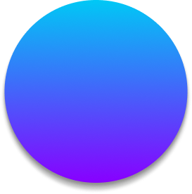

  

<h1 align="center">Arvis - AI Voice Assistant</h1>

  <b>Персональный голосовой ИИ-ассистент для Windows с полной приватностью</b>

  <a href="https://febrifugal-laronda-carbonisable.ngrok-free.dev/">🌐 Официальный сайт</a> •
  <a href="#-о-проекте">О проекте</a> •
  <a href="#-возможности">Возможности</a> •
  <a href="#-установка">Установка</a>

  
  
  
  

---

## 🎯 О проекте

**Arvis** — это современный десктопный ИИ-ассистент с голосовым управлением, созданный с фокусом на **приватность** и **офлайн-работу**. В отличие от облачных решений, Arvis обрабатывает все данные локально на вашем компьютере.

### Почему Arvis?

- 🔒 **Полная приватность** — данные не покидают ваше устройство
- 🌐 **Работает офлайн** — не требует постоянного интернета
- 🎙️ **Естественный голос** — качественный синтез речи
- 🤖 **Мощный ИИ** — интеграция с локальными LLM через Ollama
- 🎨 **Современный интерфейс** — красивый и интуитивный UI
- 🆓 **Бесплатный** — базовая версия полностью бесплатна

---

## ✨ Возможности

### 🎤 Голосовое управление
- Распознавание речи через **Vosk** (полностью офлайн)
- Естественный синтез речи: **Bark**, **Silero**, **SAPI**
- Активация голосом (wake word)
- Поддержка русского, украинского и английского языков

### 💬 Умный чат
- Интеграция с локальными LLM через **Ollama**
- Поддержка любых совместимых моделей (Llama, Mistral, Qwen и др.)
- Сохранение истории диалогов
- Режим "Live" для непрерывного общения

### 🌍 Информационные запросы
- 🌤️ **Погода** — через Open-Meteo (бесплатно)
- 📰 **Новости** — через GNews API
- 🔍 **Веб-поиск** — через SerpAPI

### 🖱️ Автоматизация
- Запуск программ голосом
- Открытие веб-сайтов
- Системные команды

### 🖼️ Мультимодальность *(в разработке)*
- Анализ изображений через Vision модели
- Работа с файлами

---

## 💻 Системные требования

| Компонент | Минимум | Рекомендуется |
|-----------|---------|---------------|
| **ОС** | Windows 10 | Windows 11 |
| **CPU** | 4 ядра | 8+ ядер |
| **RAM** | 8 GB | 16+ GB |
| **GPU** | Не требуется | NVIDIA (для ускорения) |
| **Диск** | 10 GB | SSD, 20+ GB |

---

## 📦 Установка

### Быстрая установка

1. Перейдите на [официальный сайт](https://febrifugal-laronda-carbonisable.ngrok-free.dev/)
2. Скачайте последнюю версию
3. Запустите установщик и следуйте инструкциям

### Ollama (для LLM)

Для работы ИИ-чата необходим Ollama:

1. Скачайте [Ollama](https://ollama.ai/) для Windows
2. Установите и запустите
3. Скачайте модель: `ollama pull llama3.2`

---

## 🗺️ Roadmap

### ✅ Реализовано
- [x] Голосовой ввод/вывод (Vosk + Bark/Silero)
- [x] Интеграция с Ollama
- [x] Погода, новости, веб-поиск
- [x] Современный UI на PyQt6
- [x] Многоязычность (RU/UA/EN)
- [x] Лаунчер с управлением моделями

### 🚧 В разработке
- [ ] Vision API (анализ изображений)
- [ ] RAG (работа с документами)
- [ ] Улучшенный TTS (Piper, Kokoro)
- [ ] AI-агенты и автоматизация

### 💡 Планируется
- [ ] Интеграция с календарем и почтой
- [ ] Кроссплатформенность (Linux, macOS)

---

## 🤝 Содействие

Мы приветствуем вклад в развитие проекта!

- 🐛 Нашли баг? [Создайте Issue](https://github.com/Fat1ms/Arvis/issues)
- 💡 Есть идея? [Предложите Feature](https://github.com/Fat1ms/Arvis/issues)

---

## 📄 Лицензия

Проект распространяется под лицензией **MIT**. См. [LICENSE](LICENSE).

---

## 📞 Контакты

- 🌐 **Сайт:** [febrifugal-laronda-carbonisable.ngrok-free.dev](https://febrifugal-laronda-carbonisable.ngrok-free.dev/)
- 📧 **GitHub:** [@Fat1ms](https://github.com/Fat1ms)

---

  <b>⭐ Поставьте звезду, если проект понравился! ⭐</b>

  Made with ❤️ for the community

