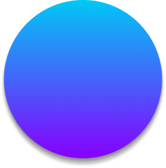
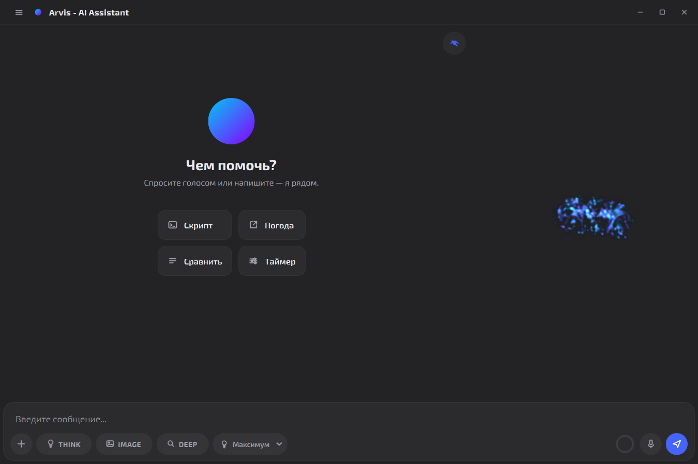
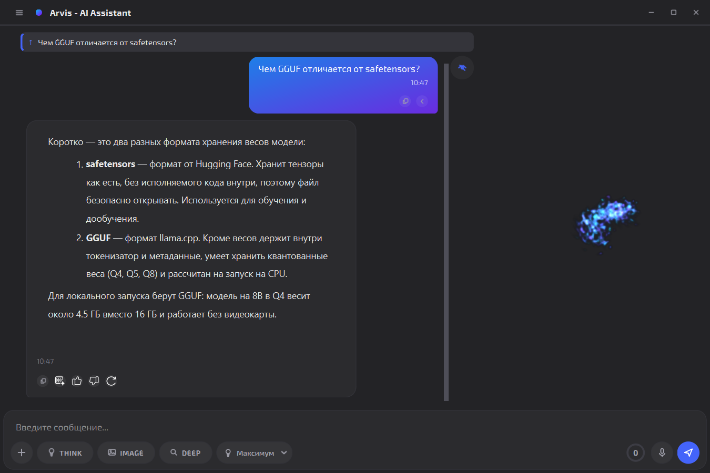
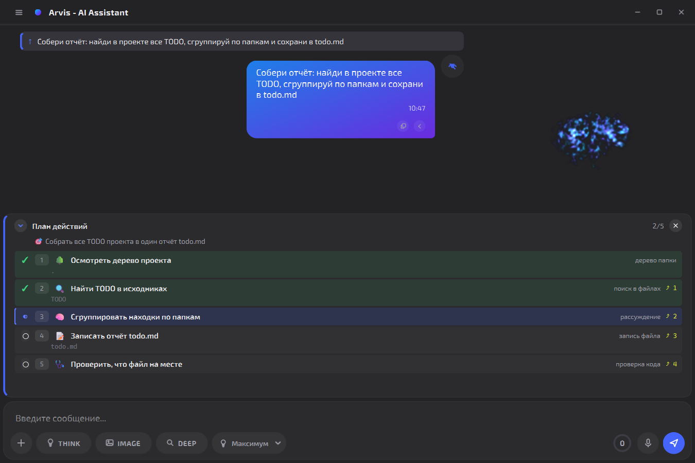
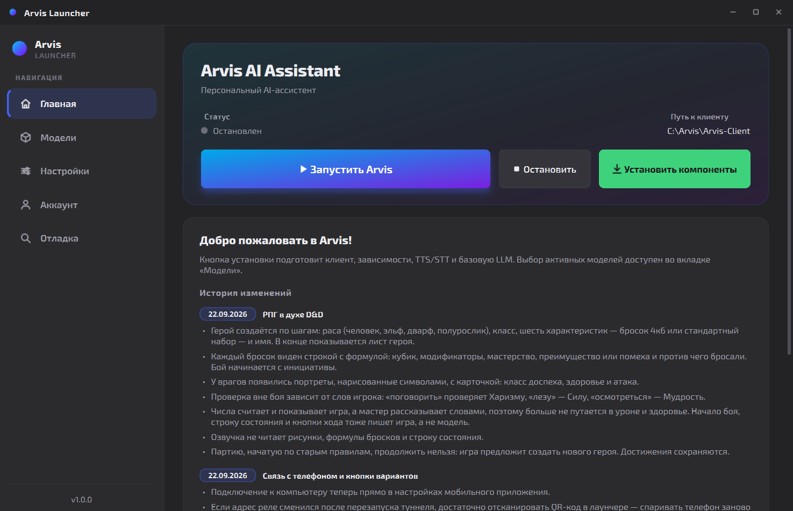
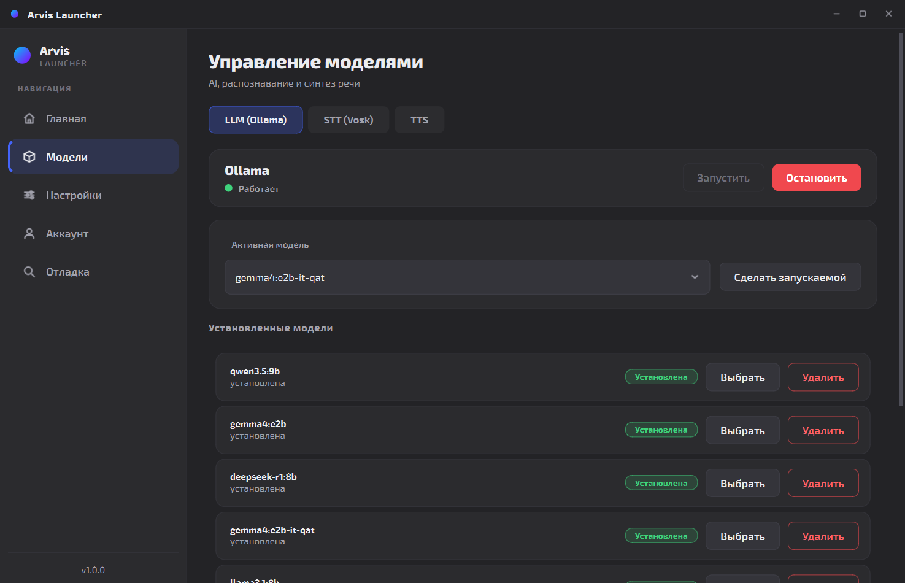
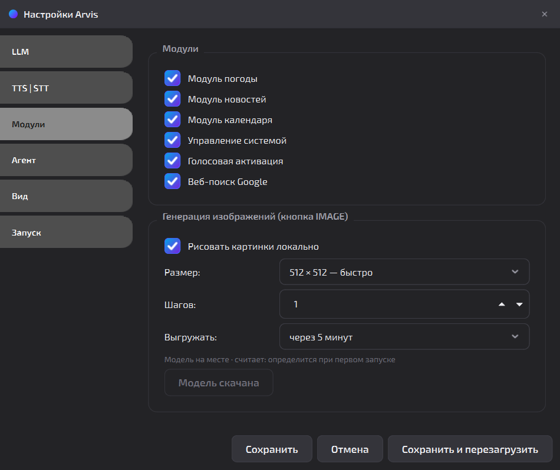
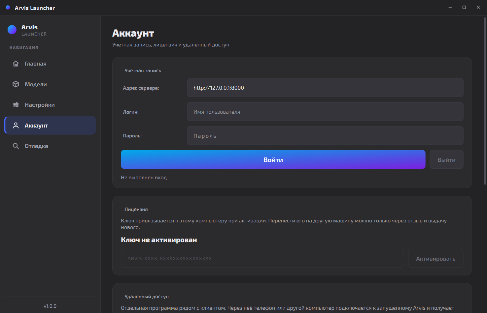
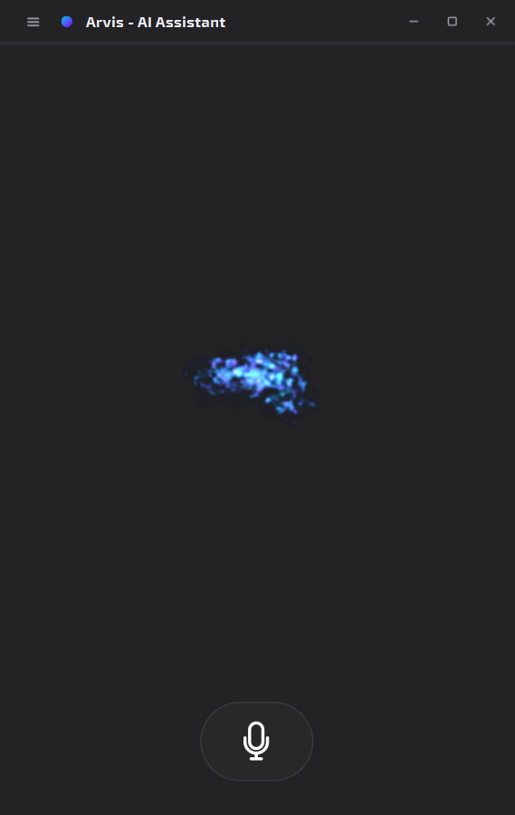

  

<h1 align="center">Arvis — персональный AI-ассистент</h1>

  <b>Голос, чат и режим агента на локальной модели. 
  Содержимое разговоров не покидает компьютер.</b>

  <a href="https://febrifugal-laronda-carbonisable.ngrok-free.dev/">🌐 Сайт</a> •
  <a href="#-как-это-выглядит">Скриншоты</a> •
  <a href="#-возможности">Возможности</a> •
  <a href="#-установка">Установка</a> •
  <a href="#-дорожная-карта">Дорожная карта</a>

  
  
  
  
  

---

  

---

## 🎯 О проекте

**Arvis** — десктопный ассистент для Windows, который работает на языковой модели,
запущенной у вас на компьютере. Не облачный сервис с локальным клиентом, а
наоборот: модель, распознавание речи и синтез голоса живут на вашей машине.

Три решения, от которых проект не отступает:

- **Локальный.** Модель считает на вашем железе. Содержимое разговоров никуда не
  уходит — это причина, по которой Arvis вообще существует рядом с облачными
  ассистентами.
- **Приватный.** Сервер знает про учётную запись и лицензию — и всё. Клиент
  полноценно работает, когда сервер недоступен.
- **Доводит задачу до конца.** Режим агента строит план, выполняет его по шагам и
  показывает, что именно сделал. Это направление, над которым идёт основная работа.

### Чем Arvis не пытается быть

Не соревнуется с Claude Code, Codex и OpenCode на их поле — задачах разработчика
на фронтир-моделях. Локальная модель на 8B там проиграет по любому измерению.
Их инженерные решения используются как источник идей, а не как цель.

---

## 🖼️ Как это выглядит

<table>
  <tr>
    <td width="50%">
      
      
<b>Чат</b> Разметка в ответах, закреплённый запрос сверху, озвучка и правка любого сообщения

    </td>
    <td width="50%">
      
      
<b>Режим агента (THINK)</b> Карта плана: что агент понял, какие шаги идут и от чего зависят

    </td>
  </tr>
  <tr>
    <td width="50%">
      
      
<b>Лаунчер</b> Установка компонентов, запуск клиента и история изменений

    </td>
    <td width="50%">
      
      
<b>Модели</b> LLM, распознавание и синтез речи — скачать, выбрать, удалить

    </td>
  </tr>
  <tr>
    <td width="50%">
      
      
<b>Настройки</b> Модули, агент, голос, внешний вид и поведение при запуске

    </td>
    <td width="50%">
      
      
<b>Аккаунт</b> Учётная запись, лицензия и удалённый доступ с телефона

    </td>
  </tr>
</table>

  

  <b>Компактный режим</b> — окно сворачивается до орба и микрофона, чтобы не мешать работе.
  Есть и мини-режим со значком в трее.

---

## ✨ Возможности

### 🎤 Голос

- Распознавание речи через **Vosk** — полностью офлайн
- Синтез речи: **Silero**, **Piper**, **Bark**, **Kokoro**, **MeloTTS**, **Supertonic**
  и системный **SAPI**. Движок подбирается под желаемое качество: от мгновенного
  до выразительного
- Активация голосом (wake word) — работает постоянно, а не только после нажатия
- Интерфейс и речь на русском, украинском, английском и испанском

### 💬 Чат

- Локальные модели через **Ollama**: Llama, Qwen, Gemma, DeepSeek и другие
  совместимые
- Потоковый ответ с разметкой, подсветкой кода и озвучкой
- История разговоров хранится на устройстве
- Любое сообщение можно переспросить, оценить или откатить разговор к нему

### 🧠 Режим агента

Кнопка **THINK** переключает ассистента в режим, где он не отвечает сразу, а
строит план и выполняет его. На карте плана видно, как агент понял задачу,
какие шаги уже сделаны и какой идёт сейчас.

Что агент умеет делать сам: читать и писать файлы, смотреть дерево папок, искать
по содержимому, запускать команды и скрипты, ходить в веб-поиск и по ссылкам,
читать PDF, делать запросы к базам (только на чтение), снимать экран,
генерировать картинки и проверять собственный результат.

### 🖼️ Картинки

Кнопка **IMAGE** отдаёт запрос локальному генератору вместо языковой модели —
**SD-Turbo** на ONNX Runtime. В сеть ничего не уходит, кроме одноразовой
загрузки весов.

### 🌍 Модули

- 🌤️ **Погода** — Open-Meteo, с запасным OpenWeatherMap
- 📰 **Новости** — через сервер Arvis, с запасным World News API
- 🔍 **Веб-поиск** — Google Custom Search и DuckDuckGo, плюс режим глубокого поиска
- 📅 **Календарь** — события и напоминания
- 🖱️ **Управление системой** — запуск программ, открытие сайтов, громкость
- 🗣️ **Языковой тренажёр** и текстовая **РПГ** в духе D&D

### 📦 Лаунчер

Отдельная программа, с которой начинается работа: ставит клиент и зависимости,
скачивает модели LLM, распознавания и синтеза речи, следит за Ollama, хранит
настройки и запускает клиент. Клиент от лаунчера не зависит — его можно
запустить и напрямую.

### 📱 Телефон и удалённый доступ

**Arvis-Relay** — отдельная программа рядом с клиентом: через неё телефон или
другой компьютер спрашивает запущенный дома Arvis и получает ответ его модели,
со всей её памятью и инструментами. Реле не стучится на вашу машину само —
только принимает подключения. Спаривание — по QR-коду в лаунчере.

**Arvis-Mobile** — клиент для Android. Отвечать может либо модель на самом
телефоне (через llama.cpp, без сети и без включённого компьютера), либо
десктопный Arvis через реле.

---

## 🧩 Как устроен проект

| Часть | Роль | Состояние |
|---|---|---|
| **Клиент** | всё, что видит пользователь: чат, голос, агент, модули | работает, активная разработка |
| **Лаунчер** | установка, запуск, модели, дизайн-система | работает |
| **Сервер** | учётные записи, лицензии, обновления | работает |
| **Реле** | удалённый доступ с телефона и других машин | текстовый канал работает; звук и видео впереди |
| **Мобильный** | Android: модель на телефоне или ответ через реле | в работе |
| **Полигон** | эталонные задачи и метрики качества агента | в работе |
| **Linux** | вторая платформа | планируется |

Сервер ни с кем не делится кодом — общается по HTTP. Клиент полноценно работает,
когда сервер недоступен: без сети остаются недоступны только сетевые модули
(новости, веб-поиск) и удалённый доступ.

---

## 💻 Системные требования

| Компонент | Минимум | Рекомендуется |
|---|---|---|
| **ОС** | Windows 10 | Windows 11 |
| **CPU** | 4 ядра | 8+ ядер |
| **RAM** | 8 ГБ | 16+ ГБ |
| **GPU** | не требуется | NVIDIA — быстрее ответ и синтез речи |
| **Диск** | 10 ГБ | SSD, 20+ ГБ |

Аппетит зависит от выбранной модели: 8B в квантовании Q4 занимает около 4.5 ГБ и
работает на процессоре. Лаунчер подбирает модель под вашу машину.

---

## 📦 Установка

Этот репозиторий — страница проекта: здесь описание, а не исходники.

1. Скачайте лаунчер с [сайта проекта](https://febrifugal-laronda-carbonisable.ngrok-free.dev/)
   *(сайт может быть временно недоступен)*
2. Запустите `ArvisLauncher.exe` и нажмите **«Установить компоненты»** — лаунчер
   сам поставит клиент, зависимости, голосовой стек и базовую модель
3. Нажмите **«Запустить Arvis»**

Дальше клиент следит за обновлениями сам и предлагает поставить новую сборку,
когда она выходит.

### Ollama

Языковые модели крутятся через [Ollama](https://ollama.ai/). Лаунчер ставит и
запускает его сам; если Ollama уже есть в системе, он её найдёт и воспользуется ею.

---

## 🗺️ Дорожная карта

Проект идёт волнами. Волна не считается закрытой, пока её цель не подтверждена
цифрами на полигоне — наборе эталонных задач с метриками.

### ✅ Уже работает

- [x] Голосовой ввод и вывод, активация голосом
- [x] Локальный чат через Ollama с разметкой и озвучкой
- [x] Режим агента: план, выполнение по шагам, карта прогресса
- [x] Локальная генерация картинок (SD-Turbo)
- [x] Погода, новости, веб-поиск, календарь, управление системой
- [x] Лаунчер: установка, модели, настройки, обновления
- [x] Учётные записи, двухфакторная аутентификация, лицензии
- [x] Удалённый доступ с телефона: текстовый канал

### 🚧 Волна 1 — «Агенту можно верить»

Локальная модель охотно докладывает «готово» там, где ничего не вышло. Один такой
случай стоит дороже десяти честных отказов.

- [ ] Контракт задачи и независимая проверка результата
- [ ] Петля ремонта: агент чинит собственные провалы
- [ ] Детектор дрейфа и живое перепланирование
- [ ] Полигон с эталонными задачами и базовыми цифрами

### 🚧 Волна 2 — «Память и длинные задачи»

- [ ] Слои памяти и структурированное сжатие разговора
- [ ] Бюджет контекста, фоновое обслуживание памяти
- [ ] Задача на 15+ шагов доходит до конца

### 💡 Волна 3 — «Плагины и платформы»

- [ ] Способности добавляются без пересборки, в том числе самим агентом
- [ ] Сборка под Linux

### 💡 Волна 4 — «Телефон»

- [ ] Мобильный клиент как полноценный второй экран
- [ ] Звук и видео через реле

---

## 🤝 Обратная связь

- 🐛 Нашли ошибку? [Создайте Issue](https://github.com/Fat1ms/Arvis/issues)
- 💡 Есть идея? [Предложите её там же](https://github.com/Fat1ms/Arvis/issues)

---

## 📄 Лицензия

Проект распространяется под лицензией **MIT**. См. [LICENSE](LICENSE).

---

## 📞 Контакты

- 🌐 **Сайт:** [febrifugal-laronda-carbonisable.ngrok-free.dev](https://febrifugal-laronda-carbonisable.ngrok-free.dev/) *(может быть временно недоступен)*
- 📧 **GitHub:** [@Fat1ms](https://github.com/Fat1ms)

---

   

  <b>Поддержать проект на Ko-Fi</b>

  <b>⭐ Поставьте звезду, если проект понравился! ⭐</b>

  Made with ❤️ for the community

